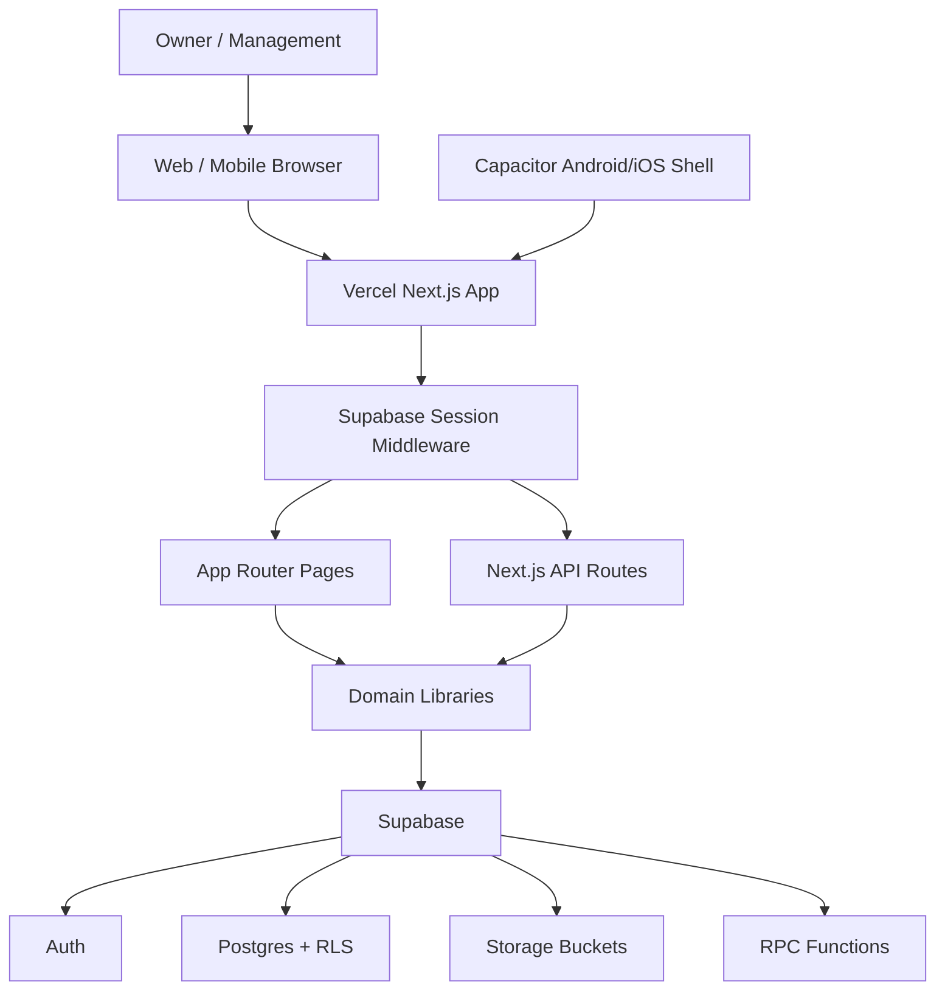

# RKJ One Architecture

Last updated: 2026-07-08

## High-Level Diagram



## Request Flow

Protected page:

1. Request reaches Vercel.
2. `proxy.ts` runs `updateSession()`.
3. If unauthenticated, request redirects to `/login`.
4. Dashboard layout loads `getCurrentProfile()`.
5. Page fetches server/client module data.
6. Supabase RLS enforces DB access.

API route:

1. Request reaches `app/api/<module>/route.ts`.
2. Middleware may redirect unauthenticated users before route execution.
3. Route calls `getCurrentProfile()`.
4. Route checks role, branch, or ownership scope.
5. Route queries Supabase.
6. Response returns JSON for successful authenticated API flow.

## Backend Patterns

Standard route imports:

```ts
import { NextResponse } from 'next/server';
import type { SupabaseClient } from '@supabase/supabase-js';
import { getCurrentProfile } from '@/lib/auth/session';
import { createClient } from '@/lib/supabase/server';
```

Branch-scoped routes should also use:

```ts
import { resolveScopedBranches, applyBranchIdsFilter } from '@/lib/auth/branch-scope';
```

Rules:

- Validate request body before database write.
- Validate `organization_id`, `branch_id`, and user/profile references.
- Return `401` for no profile inside route, `403` for access denied, `400` for bad request, `500` only for unexpected server/DB errors.
- Add database RLS that matches or is stricter than API permission logic.

## Database Architecture

Migrations are append-only under `supabase/migrations`.

Core groups:

- `00001` to `00018`: base schema, RLS, RPCs, seed data.
- `00019` to `00030`: go-live POS, stock, branch, product fixes.
- `00031` to `00111`: production hardening, factory, fleet, HR, payroll, sales agent, POS controls, area manager finance.
- `20260705*`: HR self-service and leave balances.
- `20260708090000`: POS batch reject stock count.
- `20260708100944`: Booking API table.

## Frontend Architecture

The app is domain-driven by route/module:

- `app/(dashboard)/dashboard`: owner and role cockpit.
- `app/(dashboard)/pos`: kiosk POS.
- `app/(dashboard)/inventory`: stock and transfer flows.
- `app/(dashboard)/factory`: production/factory operations.
- `app/(dashboard)/fleet`: delivery and driver workflows.
- `app/(dashboard)/finance`: finance collections and reconciliations.
- `app/(dashboard)/hr`: HR and self-service.
- `app/(dashboard)/sales-agent`: agent portal.

Components are under `components/<module>` where possible. Domain API clients are under `lib/<module>/api.ts`.

## Security Architecture

Security is layered:

- Supabase Auth identifies users.
- `profiles` assigns role, org, region, and branch.
- Next.js route guards check application intent.
- RLS protects data even if an API path is bypassed.
- Service role should be used only in server routes that require administrative operations.

High-risk fields:

- `organization_id`
- `branch_id`
- `created_by`, `reported_by`, `assigned_to`, `profile_id`
- finance amounts and bank-in proof
- payroll and staff identity data
- payment gateway references

## Deployment Architecture

Git push to `master` triggers Vercel production deployment. Supabase migrations must be applied separately with `npx supabase db push --yes` or a controlled SQL bundle.

Post-deploy checks:

- `npm run build`
- `npx vercel inspect https://rkj.one`
- `npx vercel logs https://rkj.one --since 1h --level error`
- targeted production/UAT scripts when relevant

